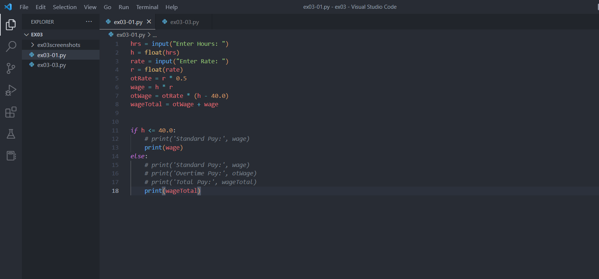
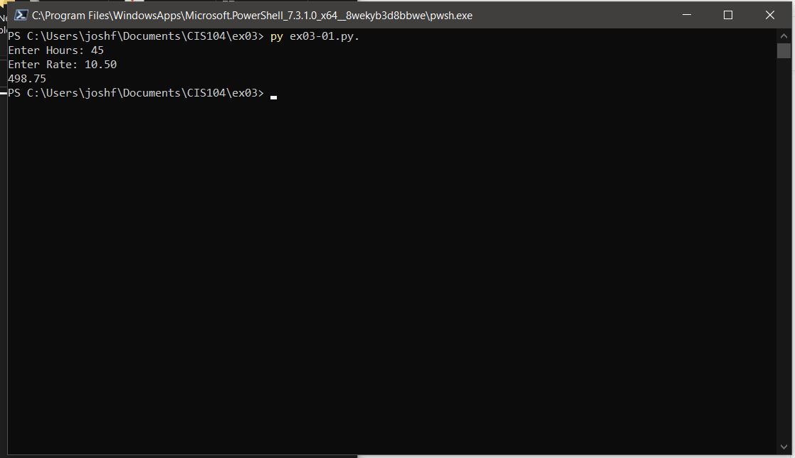
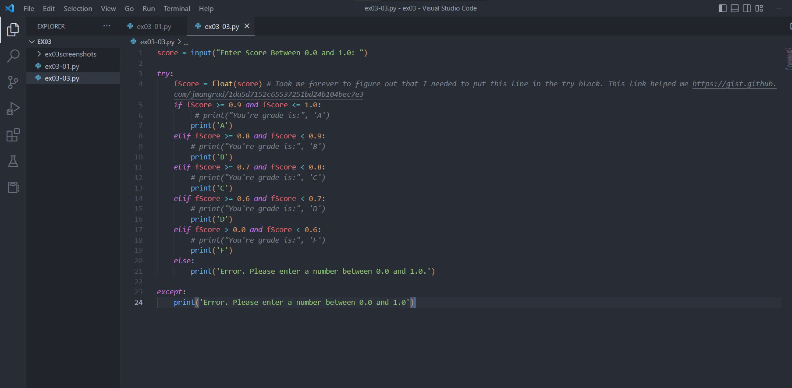
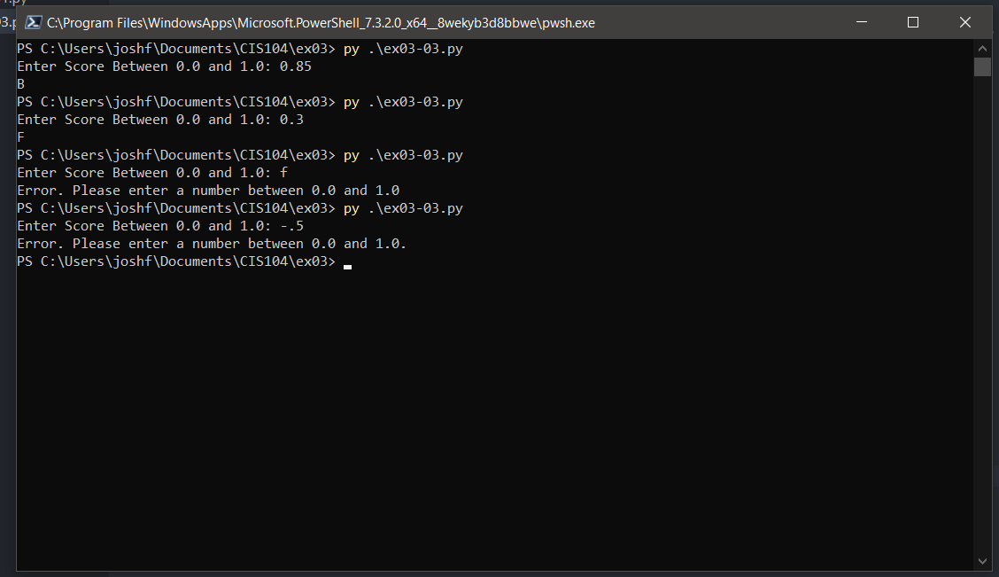

Right now this repo only contains my work on the auto-grader excercises. As far as I coluld tell, the brightspace github assignment submission link doesn't contain any other instructions. I will update when/if instructed.

